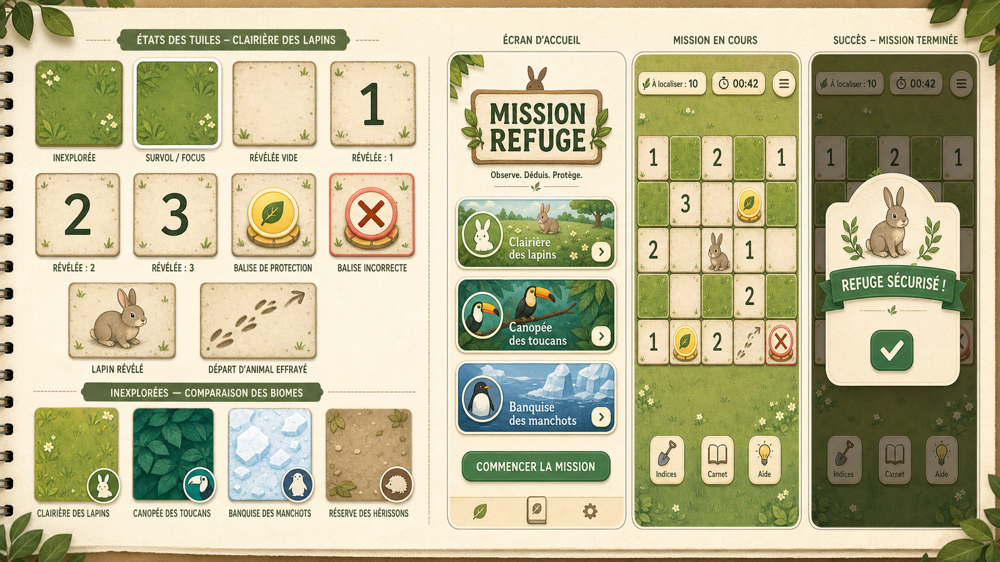
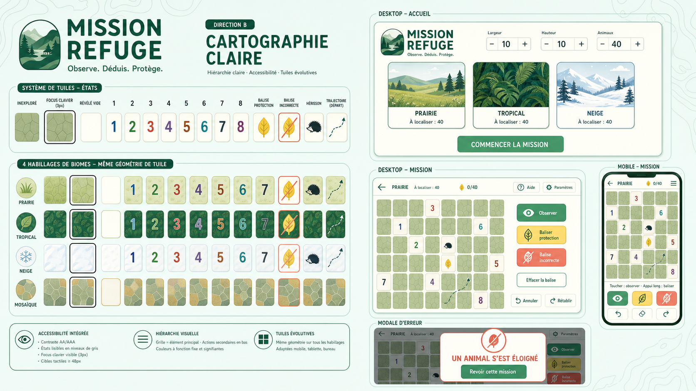
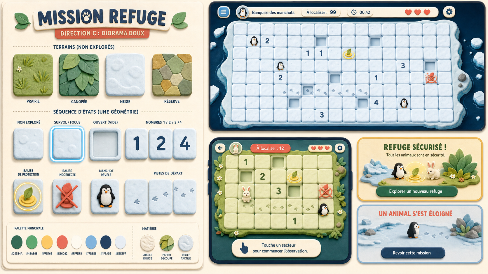

# Propositions visuelles

Ces planches explorent des directions, pas des écrans prêts à intégrer. Les textes et détails générés doivent être repris dans l’interface réelle selon les spécifications.

## A — Carnet naturaliste

La plus proche de `design.md` : papier léger, aplats découpés, végétation en bordure et grille prioritaire. À retenir pour l’identité générale et l’accueil.

## B — Cartographie claire

La plus lisible et adaptable : géométrie stable, focus fort, chiffres contrastés et décor contenu. À retenir comme base du système de cases et des grandes grilles.

## C — Diorama doux

La plus tactile et expressive : relief doux, matériaux distincts et fins de mission chaleureuses. À réserver aux bordures, à l’accueil et aux résultats pour ne pas charger la déduction.

## Direction recommandée

Combiner la structure et les cases de B avec l’identité papier de A, puis reprendre le relief de C uniquement pour les balises, les cartes de mission et les modales.

À corriger avant intégration : aucun cœur, aucune commande d’annulation, aucun animal visible pendant une mission active, aucune trace décorative dans les cases et aucun texte généré utilisé tel quel.

